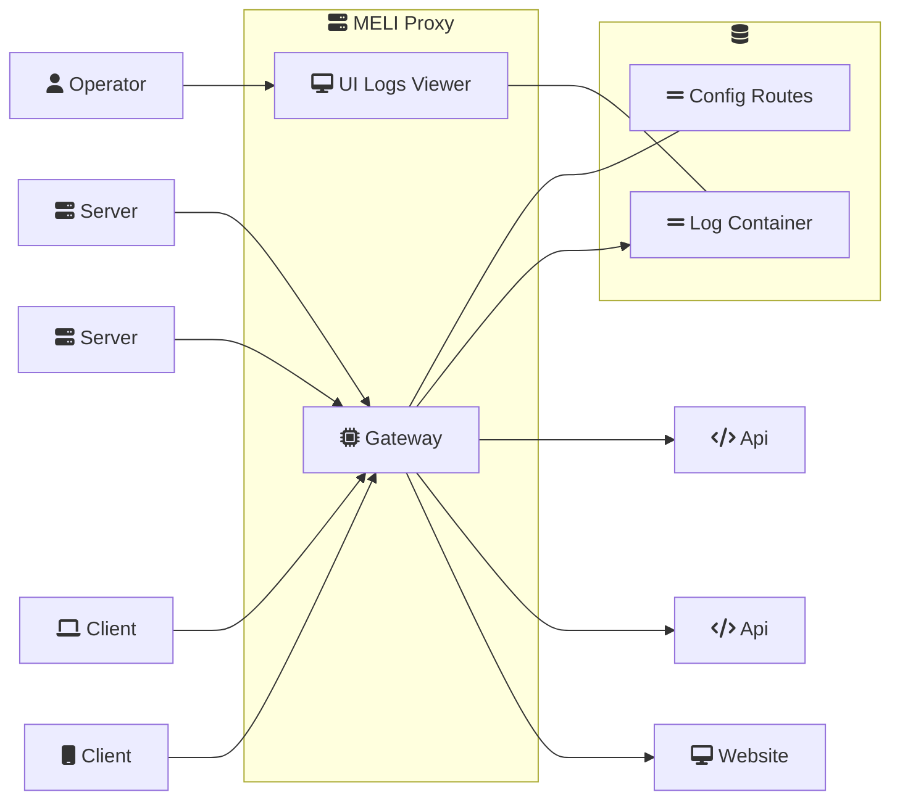

# Proxy System

```mermaid
flowchart LR
    server[fa:fa-server Server] 
    server2[fa:fa-server Server] 
    client[fa:fa-laptop Client]
    client2[fa:fa-mobile Client]
    operator[fa:fa-user Operator]
    proxy[fa:fa-microchip Gateway]
    config[fa:fa-grip-lines Config Routes]
    log[fa:fa-grip-lines Log Container]
    api1[fa:fa-code Api] 
    api2[fa:fa-code Api] 
    web1[fa:fa-desktop Website]
    ui[fa:fa-desktop UI Logs Viewer]

    subgraph database[fa:fa-database]
    log
    config
    end
    subgraph proxySystem[fa:fa-server MELI Proxy]
      proxy
      ui
    end
    proxy --- config
    proxy --> log
    ui --- log
    server --> proxy 
    server2 --> proxy 
    client --> proxy 
    client2 --> proxy
    operator --> ui
    proxy --> api1 
    proxy --> api2 
    proxy --> web1

```